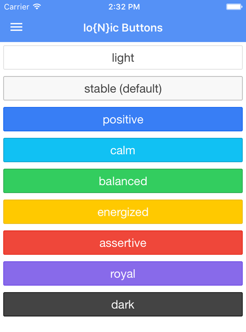
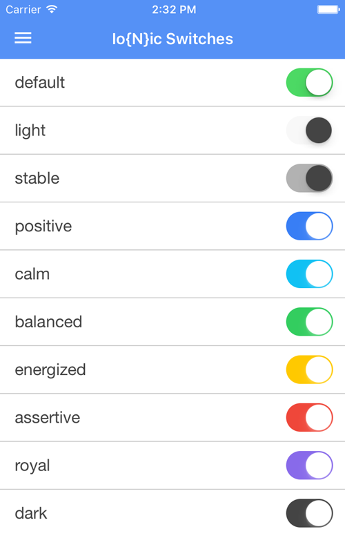
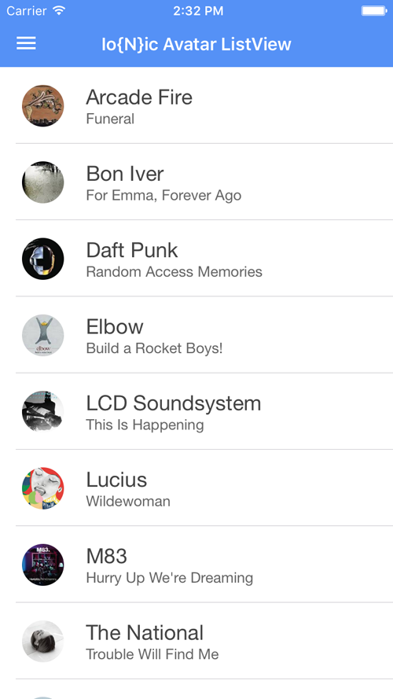
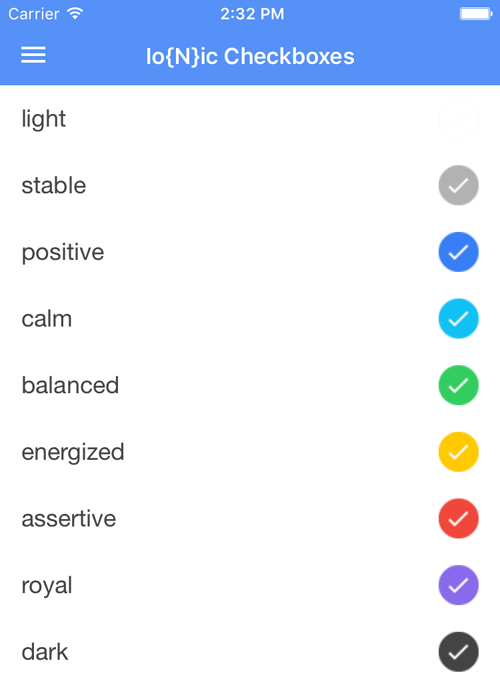
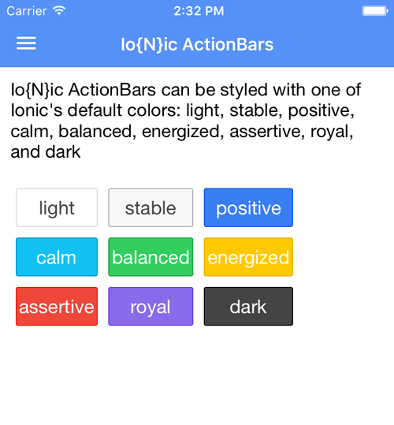

# Io{N}ic Template for NativeScript

An approximation of some common styles from [Ionic's CSS components](http://ionicframework.com/docs/components/), adapted for [NativeScript](https://www.nativescript.org/).

## Quick Start

Just grab the `app.css` file and slap it in the `app` folder of your own NativeScript project.

## Getting Started with NativeScript

Option 1: Take a look at the extensive [getting started docs](http://docs.nativescript.org/start/getting-started) on nativescript.org if you are comfortable with command-line tooling.

Option 2: Try a free 30-day trial of [Telerik Platform](http://www.telerik.com/platform), which handles SDK management, cloud builds, and provides additional services to support NativeScript app development.

## Credits

The sample app itself is based on [Burke Holland's](https://twitter.com/burkeholland) sweet [Nova theme for NativeScript](https://github.com/burkeholland/nativescript-nova).

## Examples

### Buttons

### Switches

### ListView

### Checkboxes

### ActionBars

## License

Apache License (v2)